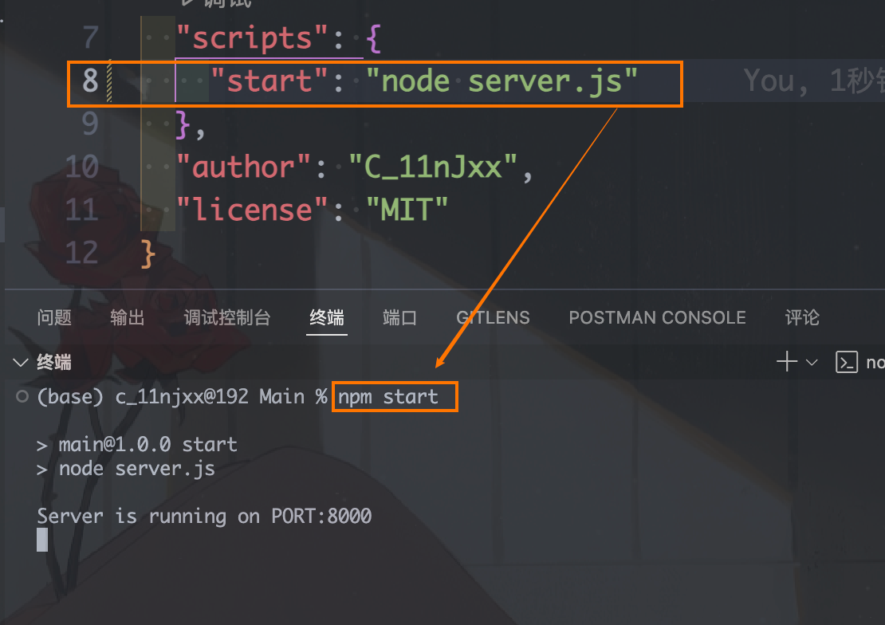
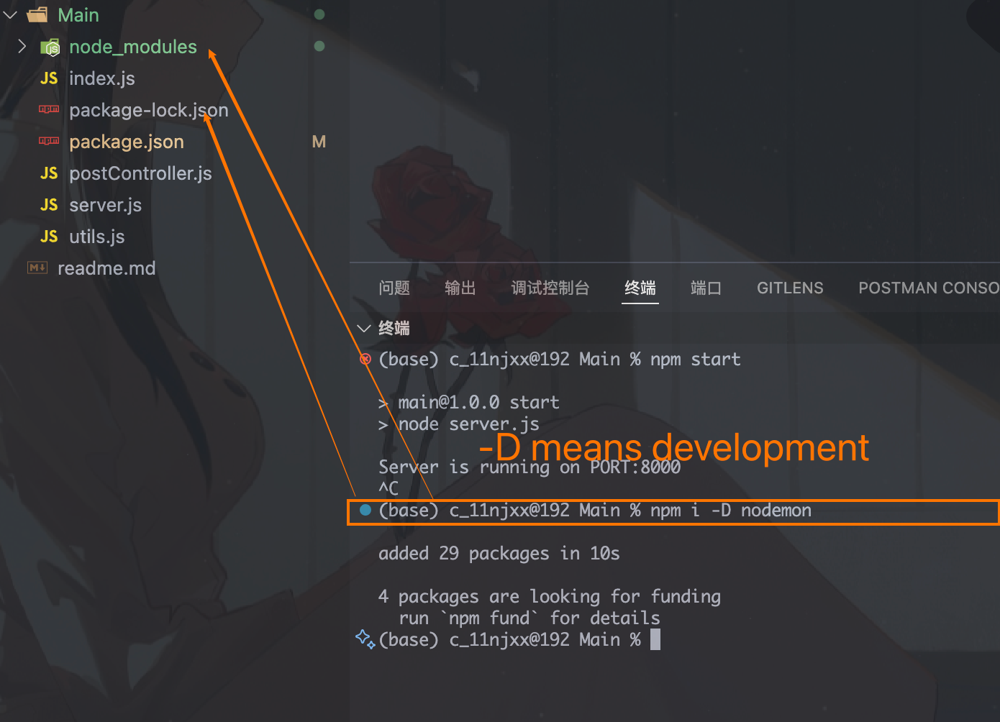
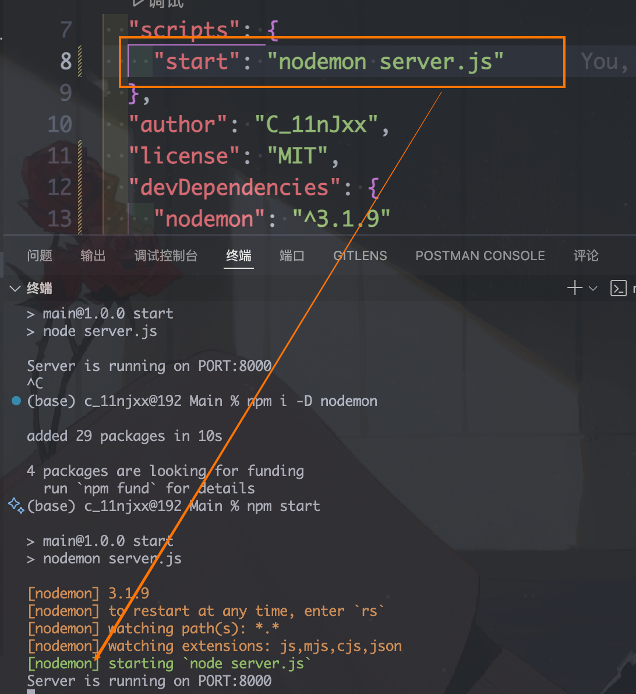

```
except for "start" and "dev" which you can use npm start or npm test
if you want to use "dev": "node server.js"
you have to use npm run dev
```


```
package-lock.json stores the dependency tree
```

```
You can just delete the node_modules folder and run 'npm install'
the dependency in package.json will be installed
so there is no need to upload node_modules to github
```

```
add .gitignore
```
```
Use nodemon
```
